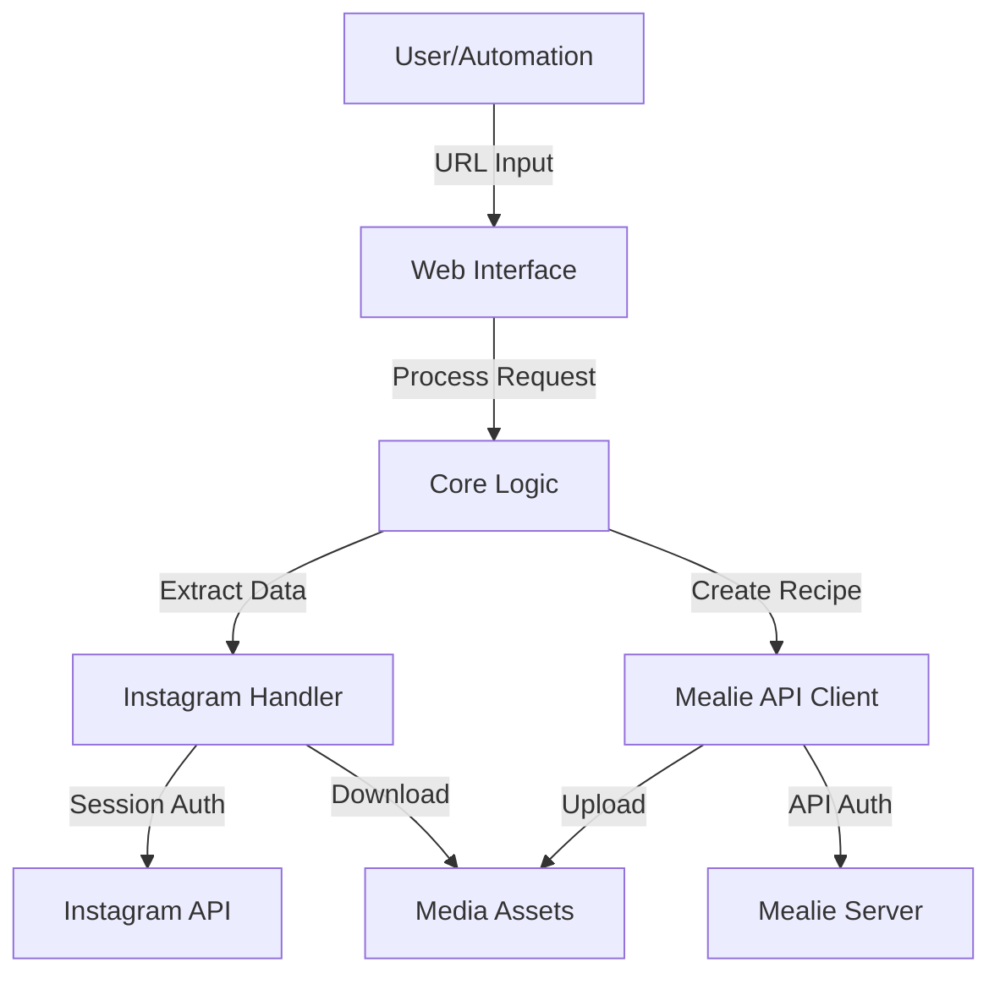

# System Patterns

## Architecture Overview

## Component Structure
1. Web Layer (`main.py`, `templates/`)
   - Flask server
   - Simple HTML interface
   - API endpoint handling
   - Environment configuration

2. Instagram Integration (`helpers/instadownloader.py`)
   - Post data extraction
   - Media download
   - Authentication management
   - Session handling

3. Mealie Integration (`helpers/mealie_api.py`)
   - API client implementation
   - Recipe creation/update
   - Media upload handling
   - Error management

4. Authentication Helpers (`helpers/instaloader_login_helper.py`)
   - Session file generation
   - Login credential management
   - Two-factor auth support

## Design Patterns
1. Separation of Concerns
   - Clear module boundaries
   - Dedicated helper classes
   - Configuration isolation

2. API Client Pattern
   - Abstracted API interactions
   - Error handling
   - Authentication management

3. Environmental Configuration
   - Docker-friendly setup
   - Flexible authentication options
   - Configurable timeouts

## Data Flow Patterns
1. Request Processing
   - URL validation
   - Authentication checks
   - Error handling

2. Content Processing
   - Instagram data extraction
   - Media download and processing
   - Recipe format conversion

3. Integration Flow
   - Sequential processing
   - Error recovery
   - Status feedback
