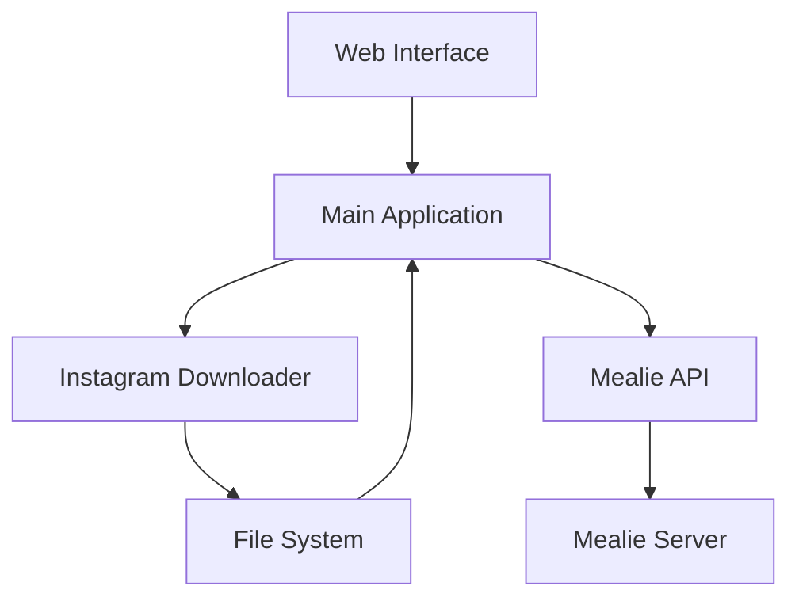
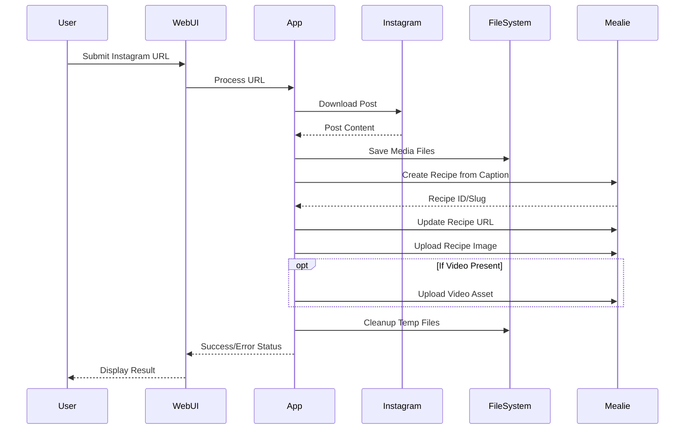

# System Patterns: Instagram To Mealie

## Architecture Overview

InstagramToMealie follows a simple, modular architecture designed for reliability and maintainability. The system is composed of the following key components:

```mermaid
graph TD
    A[Web Interface] --> B[Main Application]
    B --> C[Instagram Downloader]
    B --> D[Mealie API]
    C --> E[File System]
    D --> F[Mealie Server]
    E --> B
```

## Core Components

### 1. Web Interface (Flask)
- Provides a simple HTML form for URL input
- Handles both direct form submissions and URL parameters
- Displays processing status and error messages
- Implemented using Flask and basic HTML/CSS

### 2. Main Application (main.py)
- Orchestrates the overall process flow
- Validates environment variables and configuration
- Manages the connection between Instagram and Mealie components
- Handles error conditions and cleanup

### 3. Instagram Downloader (instadownloader.py)
- Authenticates with Instagram using session files or credentials
- Validates and processes Instagram URLs
- Downloads post content, images, and videos
- Extracts metadata from posts

### 4. Mealie API Client (mealie_api.py)
- Authenticates with Mealie API
- Creates recipes from HTML content
- Uploads images and videos as recipe assets
- Updates recipe metadata

### 5. File System Management
- Temporary storage of downloaded content
- Organized directory structure for downloads
- Cleanup of temporary files after processing

## Key Design Patterns

### 1. Dependency Injection
- External dependencies (Instagram, Mealie) are injected into components
- Facilitates testing and component isolation

### 2. Service-Oriented Architecture
- Clear separation between Instagram and Mealie services
- Well-defined interfaces between components

### 3. Environment-Based Configuration
- All configuration managed through environment variables
- No hardcoded credentials or endpoints

### 4. Error Handling and Recovery
- Comprehensive try/except blocks
- Cleanup of resources in error cases
- Clear error messages propagated to the user

## Data Flow

### Instagram Post Import Process

```mermaid
sequenceDiagram
    participant User
    participant WebUI
    participant App
    participant Instagram
    participant FileSystem
    participant Mealie
    
    User->>WebUI: Submit Instagram URL
    WebUI->>App: Process URL
    App->>Instagram: Download Post
    Instagram-->>App: Post Content
    App->>FileSystem: Save Media Files
    App->>Mealie: Create Recipe from Caption
    Mealie-->>App: Recipe ID/Slug
    App->>Mealie: Update Recipe URL
    App->>Mealie: Upload Recipe Image
    opt If Video Present
        App->>Mealie: Upload Video Asset
    end
    App->>FileSystem: Cleanup Temp Files
    App-->>WebUI: Success/Error Status
    WebUI-->>User: Display Result
```

## Authentication Patterns

### Instagram Authentication
- Primary: Session-based authentication
  - Uses Firefox cookies exported to a session file
  - More reliable and less prone to rate limiting
- Fallback: Username/password authentication
  - Optional TOTP (Two-Factor Authentication) support
  - More susceptible to rate limiting and security challenges

### Mealie Authentication
- API key-based authentication
- Bearer token in HTTP headers
- Connection validation on startup

## Error Handling Patterns

1. **Validation First**: Environment variables and configuration validated at startup
2. **Graceful Degradation**: Attempt to continue processing when possible
3. **Resource Cleanup**: Temporary files removed even in error cases
4. **User Feedback**: Clear error messages propagated to the user interface
5. **Logging**: Error details logged for troubleshooting

## Integration Patterns

### Instagram Integration
- URL parsing and validation
- Session-based authentication
- Media download and metadata extraction

### Mealie Integration
- API-based communication
- OpenAI/Ollama for recipe extraction
- Multi-part form uploads for media files
